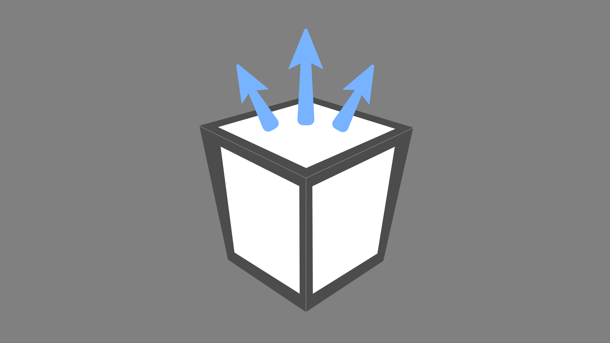

# AssetRipper

 

AssetRipper is a tool for extracting assets from serialized files (*CAB-*\*, *\*.assets*, *\*.sharedAssets*, etc.) and assets bundles (*\*.unity3d*, *\*.assetbundle*, etc.) and converting them into the native Unity engine format.

> Important note: This project is currently in an experimental state. Expect bugs and many changes.

Current supported versions: `1.x` to `2019.x` (support for later versions is in progress)

## Export features
* Scenes
* Prefabs (GameObjects with transform components)
* AnimationClips (legacy, generic, humanoid)
* Meshes
* Shaders (native listing)
* Textures
* Audio
* Fonts
* Movie textures
* Materials
* AnimatorControllers
* Avatars
* Terrains
* TextAssets
* Components:
  * MeshRenderer
  * SkinnedMeshRenderer
  * Animation
  * Animator
  * Canvas
  * Light
  * ParticleSystem
  * Colliders
  * Rigidbody
  * AudioSource
  * Camera
  * MonoBehaviour (Mono only)
  * MonoScript (Mono only)

## Structure

* *AssetRipperCore*

   Core library. It's designed as an single module without any third party dependencies.
   
* *AssetRipperLibrary*

   This is an expansion library for AssetRipperCore. It includes some third party dependencies and has some extra converters, so it additionally exports:
   * AudioClip .wav export
   * Texture2D .png export (with Sprites)
   * References to build-in Engine assets

* *AssetRipperGUI*

   Basic graphic interface application utilizing the AssetRipperLibrary. Since it's Windows-only, it can also export:
   * Shader DirectX blob export
   
* *AssetRipperConsole*

   This is intended to become a cross-platform command line application. Drag and drop resource file(s) or/and folder(s) onto the .exe to retrieve the assets. It will then automaticly try to find resource dependencies, create a 'Ripped' folder and extract all supported assets into the created directory.

## Requirements:

If you want to build a solution, you'll need:

 * [.NET 5](https://dotnet.microsoft.com/download/dotnet/5.0)

 * Compiler with C# 9 syntax support, such as [Visual Studio 2019](https://visualstudio.microsoft.com/downloads/)

If you want to run binary files, you need to install:

 * [Unity 2017.3.0f3 or greater](https://unity3d.com/get-unity/download/archive) (NOTE: your editor version must be no less than the game's version)
 

## To Do
 * Update Mono.Cecil
 * Some other third party projects need updated too
 * Set up proper build actions
 * Readme's describing the purpose of each subproject
 * Add some basic unit testing

## Goals
 * IL2Cpp support
 * Unity 2020 and 2021 support
 * Dummy shader implementation
 * Cross-Platform console application
 * NAudio implementation for exporting other audio formats

## License

AssetRipper is licensed under the GNU General Public License v3.0

## Copyright Issues

Please be aware that distributing the output from this software may be against copyright legislation in your jurisdiction. You are responsible for ensuring that you're not breaking any laws.

## Credits

This began as a fork of [mafaca](https://github.com/mafaca)'s [uTinyRipper](https://github.com/mafaca/UtinyRipper) project licensed under the MIT license.

It has borrowed code from [Perfare](https://github.com/Perfare)'s [AssetStudio](https://github.com/Perfare/AssetStudio) project licensed under the MIT license.

[Mono.Cecil](https://github.com/jbevain/cecil) is licensed under the MIT license.

[Brotli](https://github.com/google/brotli) is licensed under the MIT license.

[SpirV](https://github.com/Anteru/csspv) is licensed under the BSD 2-Clause license.

[Lz4](https://github.com/lz4/lz4) is licensed under the MIT license and the BSD 2-Clause license.

[Smolv](https://github.com/aras-p/smol-v) is licensed under the MIT license.

## Disclaimer

This software is not sponsored by or affiliated with Unity Technologies or its affiliates. "Unity" is a registered trademark of Unity Technologies or its affiliates in the U.S. and elsewhere.