# Running on mac
In order to run Asset Ripper on mac, you'll first need to have everything listed in the [requirements](https://assetripper.github.io/AssetRipper/articles/Requirements.html) tab.

## Running the GUI version
If you're done with the requirements, lets see how to run the GUI version.

First, you'll need to download the GUI release from [here](https://github.com/AssetRipper/AssetRipper/releases).

Make sure you download the `AssetRipperGUI_mac64.zip` file as shown below.

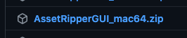

After downloading, right click and open the file to extract as shown below.

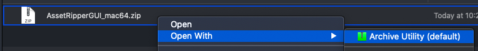

After extracting, you should see this folder named `AssetRipperGUI_mac64`.

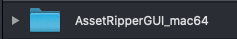

And inside that folder, there should be many other files:

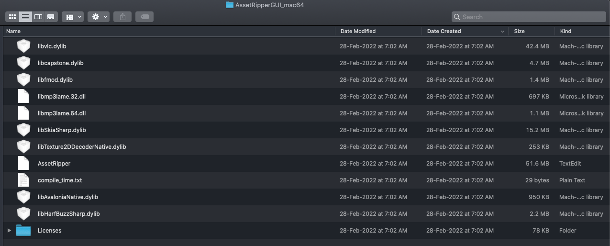

You should also see this file called `AssetRipper`.

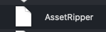

Now go back to the `AssetRipperGUI_mac64` folder and select it. Then go to `Finder`, `Services`, `New Terminal at Folder` as shown.

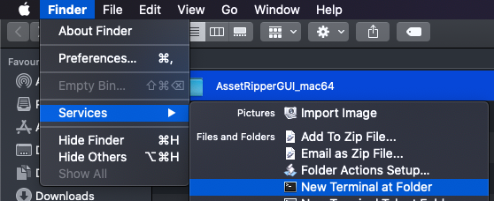

Now you should see the terminal open:

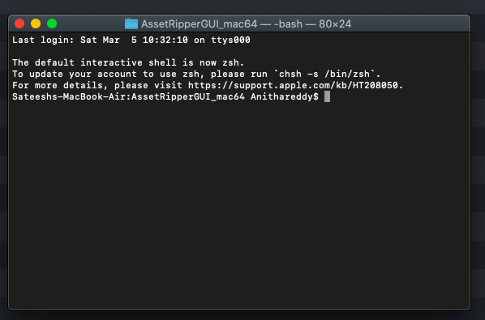

Now you'll need to type in the following command and press `enter`:

```
./AssetRipper
```

Then you should see an error saying `-bash: ./AssetRipper: Permission denied`.

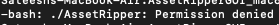

To fix that, you'll need to type in this command:

```
chmod +x AssetRipper
```
After entering that, you should see an empty line

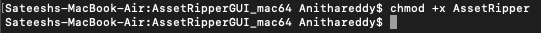

Now again try the following command and it should work.

```
./AssetRipper
```

Now something like this should pop up:

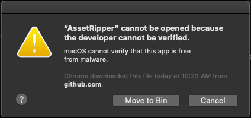

Click cancel. To verify that, you'll need to open system preferences using `⌘ + space` and search for `System preferences` and press `enter`. Then inside, find for `Security & Privacy` as shown below:

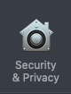

Now go to the `General` tab:

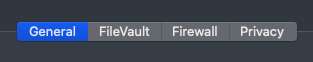

And at the bottom, something like this should popup. Click Allow Anyway:

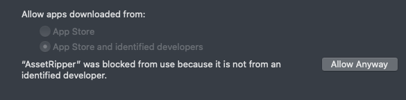

Now again try this command:

```
./AssetRipper
```

Then it will show something like this, click Open:

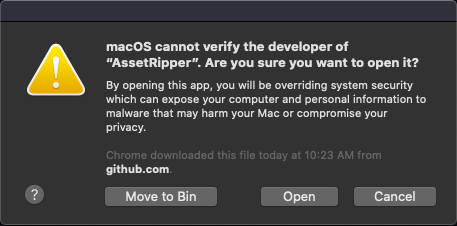

Then things like this will popup, click OK and do the same steps shown above to open them:

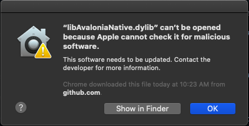

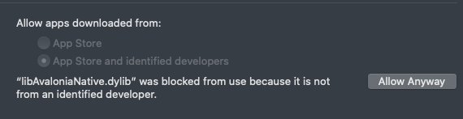

Like that you should see multiple popups, click OK and allow them.

After a while, you should see Asset Ripper GUI open:

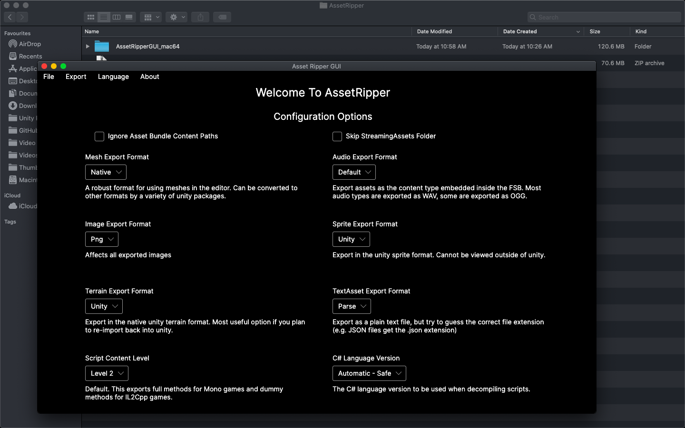

Now lets say you got it opened, but you closed it and want to open it again. But luckily, you won't need to follow all the steps above to open again!

Just go to the `AssetRipperGUI_mac64` folder and double click this file and it should open again!

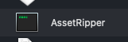

And there you have it :)

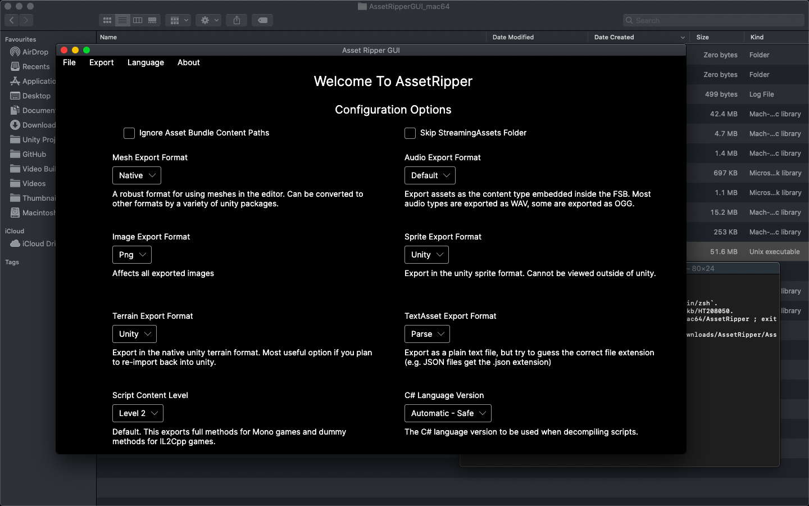
